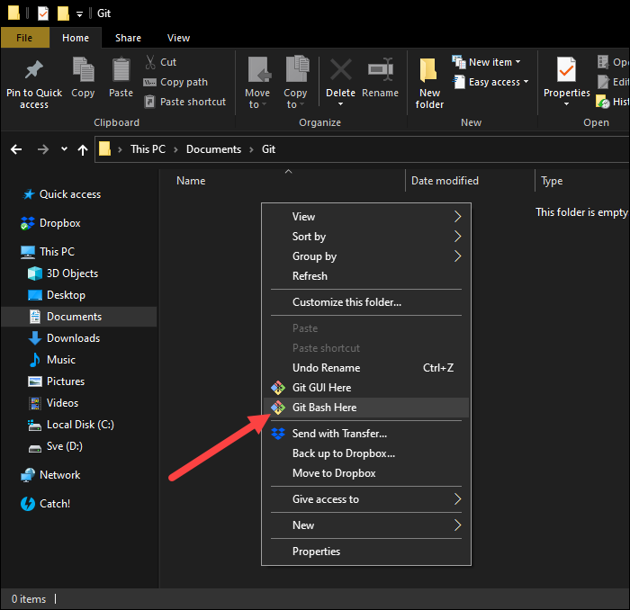

# Pollen, Particulate Matter, and Respiratory Mortality

## TL;DR

This project can be executed by running the [main.sh](main.sh)[1] or [main.bat](main.bat)[2] file in the root directory of this repo. The following constants **<ins>need to be altered</ins>** before executing:

- `seasonal_df`: degree of freedom for seasonal term in `glm()` model
- `temperature_df`: degree of freedom for temperature term in `glm()` model
- `root_dir`: the directory that this repo lies in on the user's computer

Prerequisites are as follows:

- `/data/lagdata.csv` (format can be provided by author upon request--data itself is private)
- `R` version `^4.4.1`
- `R` libraries:
  - dplyr, ggplot2, ggtext, scales, lubridate, Epi, tsModel, splines, mgcv, metafor, data.table, cowplot

The generated figures can be found under `/plots`.

### Notes

[1] `main.sh` is for Linux or Mac users. Open terminal and type `bash main.sh` to run. 
[2] `main.bat` is for Windows users. Double click the `.bat` file to run. Windows users can also run `main.sh` by launching `git bash` from [within the repo](#git-bash). If `main.bat` does not work, please try the `git bash` > `main.sh` method.

## Intro

The relevant layout of the repo is:

- `/data`: Houses all the data (initial, intermediary, final). Crucial requires `lagdata.csv` to run the code. 
- `/src`: Houses all the `R` scripts to run the project
- `/plots`: Houses all the resulting figures and supplementary figures

Diving deeper into the `/src` directory, it is divided in four main parts:

- [preprocessing.R](src/preprocessing.R)
- [modeling.R](src/modeling.R)
- [plots.R](src/plots.R)
- [sensitivity.R](src/sensitivity.R)

## Preprocessing

Data is preprocessed and cut up before modeling. Crucially, pollen is bifucated into quantiles as `1` or `2` (bisection) at hard-coded, predetermined cutoffs. These cutoffs are at `75%`, `80%`, `85%`, `25 count`[1] , `50 count`[1] , and `75 count`[1]. Data is saved to the `/data` directory after the preprocessing step.

### Notes

[1] Pollen counts are determined by the [Durham technique](https://www.jasco-global.com/solutions/analysis-of-pollen-collected-by-durham-sampler-method-using-infrared-microscope-and-particle-size-shape-analysis-software/). Also, the cutoffs are reflected in [figure2](/plots/figure2.pdf) and [figure3](/plots/figure3.pdf), as well as some of the supplementary figures.

## Modeling

Three base models are utilized for analysis. `R`'s `glm()` function is utilized for modeling.

- **Single Pollutant Model:** Outcome ~ Exposure
- **Interactive Model:** Outcome ~ Exposure:Interactive
- **Interactive + Confounding Pollutant Model:** Outcome ~ Exposure:Interactive + Confounding Pollutant1

Various outcomes, exposures, confounders, and lags are examined, but these are the main of interest (i.e. shows up on the figures):

- **Outcomes:** All-cause, respiratory, cardiovascular, all-cause ages ≥65, respiratory ages ≥65, cardiovascular ages ≥65 mortality
- **Exposure:** [SPM](https://www.env.go.jp/en/air/aq/aq.html#:~:text=infrared%20analyzer%20method-,Suspended%20particulate%20matter,-The%20daily%20average)
- **Interactive:** Quantized sugi + hinoki counts (i.e. every day is bifurcated as `1` or `2`)
- **Confounders:** [SO2](https://www.env.go.jp/en/air/aq/aq.html#:~:text=Measuring%20method-,Sulfur%20dioxide,-The%20daily%20average), [NO2](https://www.env.go.jp/en/air/aq/aq.html#:~:text=the%20above%20methods.-,Nitrogen%20dioxide,-The%20daily%20average)
- **Lags:** 0, 1, 2, 3, 4, 5, ma2 0-1, ma 0-2, ma 0-3, ma 0-4, ma 0-5

All analyses are done independently in eight different Kyushu cities. Data from all cities are then aggregated with the [metafor](https://www.metafor-project.org/doku.php/metafor) package.

### Notes

[1] For the confounding model, gaseous pollutants (SO2, NO2) are the factors. Other confounding terms such as long-term time trend, seasonality, temperature, etc are also included but this discussion is concerned with exposures (and confounders) of interest--i.e. air pollutants. 
[2] "ma" denotes [moving average](https://en.wikipedia.org/wiki/Moving_average)

## Plots

The following figures are included in this project:

- **Figure 1:** Study area map (cities) and pollen clinic / air pollution stations
- **Figure 2:** Single model (noninteractive), `SPM` on mortality + mortality ages ≥65 
- **Figure 3:** Interactive model, `SPM`:`pollen` on mortality
- **Figure S1:** Interactive model, `SPM`:`pollen` on mortality ages ≥65
- **Figure S2:** Interactive + confounding model, `NO2` as confounder
- **Figure S3:** Interactive + confounding model, `SO2` as confounder

Code for Figure 1 was moved to [`misc.R`](/src/misc.R) because the library utilized to create part of the map tries to fetch data from a dead link.

## Sensitivity

For sensitivity analyses, we vary the degree of freedom for two confounding terms:

- Seasonality splines degree of freedom
- Temperature splines degree of freedom

Both confounding terms are included in the model as natural splines, `splines::ns()`. We have to provide a degree of freedom for these terms--our goal is to search for robustness of effect.

The model is single pollutant, modeling respiratory mortality ~ SPM at lag 1 (`resp ~ SPM_1`). This model is perpetuated across all eight cities and the `qAIC`[1], `rr`[2], `cil`[3], and `ciu`[4] are extracted. These results are then pooled across all eight cities using the `metafor` package.

### Notes

[1] A modification of Akaike's Information Criterion for overdispersed count data (or its version corrected for small sample, “quasi-AIC
”), for one or several fitted model objects.  
[2] Relative risk.  
[3] Confidence interval lower.  
[4] Confidence interval upper.  

## Appendix

### Git Bash

