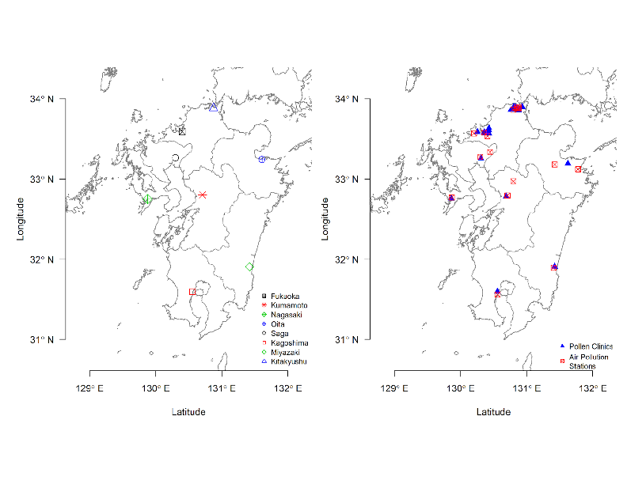

# Plots

Plots can be converted from `.pdf` to `.png` format using [imagemagick](https://imagemagick.org/index.php). Imagemagick can be downloaded on macOS with `brew install imagemagick` or on Linux with `sudo apt-get install imagemagick`. The commands to convert is shown below.


```zsh
cd plots
magick figure1.pdf figure1.png
magick figure2.pdf figure2.png
magick figure3.pdf figure3.png
magick figureS1.pdf figureS1.png
magick figureS2.pdf figureS2.png
magick figureS3.pdf figureS3.png
```

# Figures

## Figure 1



## Figure 2


## Figure 3


# Supplementary Figures

## Figure S1


## Figure S2


## Figure S3


